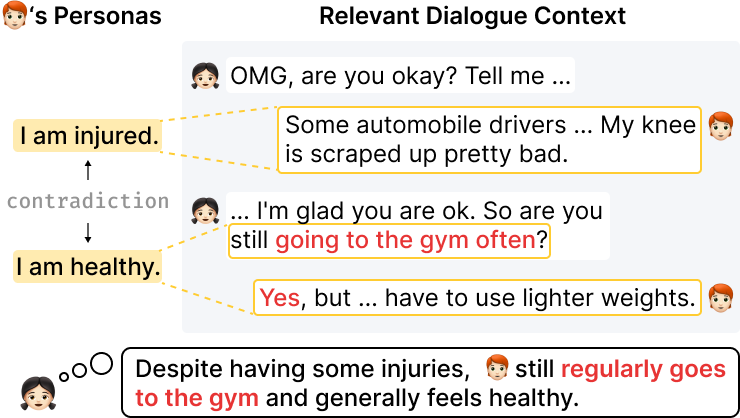

# Commonsense-augmented Memory Construction and Management in Long-term Conversations via Context-aware Persona Refinement

---

<p align="center">
  
</p>

The Official Repository of the paper **"Commonsense-augmented Memory Construction and Management in Long-term Conversations via Context-aware Persona Refinement"**.

This paper is accepted to **EACL 2024**.

Authors: Hana Kim, Kai Tzu-iunn Ong, Seoyeon Kim, Dongha Lee, Jinyoung Yeo

Paper Link: https://aclanthology.org/2024.eacl-short.11/

## Data

We adopt Multi-session Chat (MSC) from the paper "Beyond Goldfish Memory: Long-Term Open-Domain Conversation"
You can implement our methods with any dataset of choice.
To access MSC, please refer to https://aclanthology.org/2022.acl-long.356/.

## Requirements

Make sure PyTorch (>= 1.8.0) is installed.\
We run Contriever and the NLI model on eight NVIDIA RTX A5000 GPUs.\
For ChatGPT API usage, we use $35.52 on CAFFEINE’s refinement, and $27.09 on response generation

## Implementations

- **./main.py**: Set up configurations and run experiments.
- **./src/update_memory.py**: Given an existing memory (persona) pool, measuring contradiction between personas using the DNLI model and prepare the data for persona refinement.
- **./src/persona_refinement.py**: Perform persona refinement.
- **./response_generation/src/contriever.py**: Memory retrieval for response generation.
- **./response_generation/src/inference_chatgpt.py**: Response generation using ChatGPT.
- **./response_generation/src/eval.py**: Automatic evaluations for generated responses.

## Cite this work

If you find this paper helpful, please use the following BibTeX to cite our paper, thank you!

```
@inproceedings{kim-etal-2024-commonsense,
    title = "Commonsense-augmented Memory Construction and Management in Long-term Conversations via Context-aware Persona Refinement",
    author = "Kim, Hana  and
      Ong, Kai  and
      Kim, Seoyeon  and
      Lee, Dongha  and
      Yeo, Jinyoung",
    editor = "Graham, Yvette  and
      Purver, Matthew",
    booktitle = "Proceedings of the 18th Conference of the European Chapter of the Association for Computational Linguistics (Volume 2: Short Papers)",
    month = mar,
    year = "2024",
    address = "St. Julian{'}s, Malta",
    publisher = "Association for Computational Linguistics",
    url = "https://aclanthology.org/2024.eacl-short.11",
    pages = "104--123",
    abstract = "Memorizing and utilizing speakers{'} personas is a common practice for response generation in long-term conversations. Yet, human-authored datasets often provide uninformative persona sentences that hinder response quality. This paper presents a novel framework that leverages commonsense-based persona expansion to address such issues in long-term conversation.While prior work focuses on not producing personas that contradict others, we focus on transforming contradictory personas into sentences that contain rich speaker information, by refining them based on their contextual backgrounds with designed strategies. As the pioneer of persona expansion in multi-session settings, our framework facilitates better response generation via human-like persona refinement. The supplementary video of our work is available at https://caffeine-15bbf.web.app/.",
}
```
